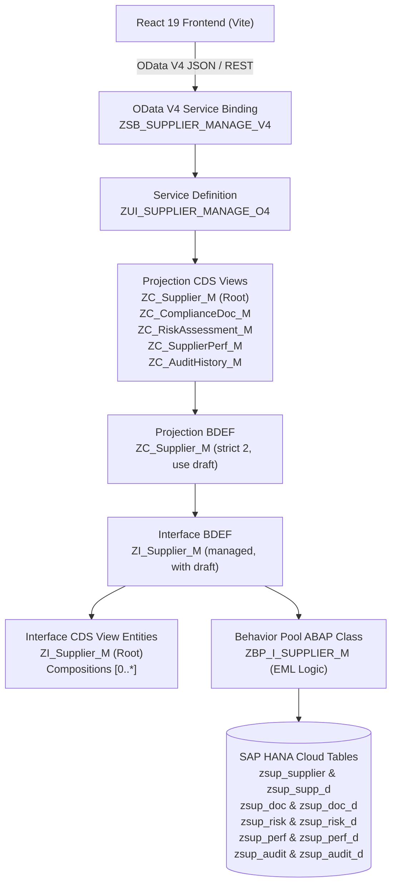

# SAP ABAP Cloud RAP Backend: Supplier Risk & Purchase Compliance Management

Production-grade **SAP ABAP Cloud** backend built on the **RESTful Application Programming Model (RAP)**, **CDS View Entities**, **EML (Entity Manipulation Language)**, and **OData V4** on **SAP HANA Cloud**.

---

## 1. Architecture Overview



---

## 2. Business Objects & Compositions

### Composition Tree
```
ZI_Supplier_M (Root)
 ├── _ComplianceDocuments (composition [0..*] of ZI_ComplianceDoc_M)
 ├── _RiskAssessments     (composition [0..*] of ZI_RiskAssessment_M)
 ├── _Performance         (composition [0..*] of ZI_SupplierPerf_M)
 └── _AuditHistory        (composition [0..*] of ZI_AuditHistory_M)
```

| Entity | Interface View | Projection View | Persistent Table | Draft Table | Key |
|---|---|---|---|---|---|
| **Supplier** | `ZI_Supplier_M` | `ZC_Supplier_M` | `zsup_supplier` | `zsup_supp_d` | `SupplierID` (CHAR10) |
| **Compliance Document** | `ZI_ComplianceDoc_M` | `ZC_ComplianceDoc_M` | `zsup_doc` | `zsup_doc_d` | `DocumentID` (CHAR10) |
| **Risk Assessment** | `ZI_RiskAssessment_M` | `ZC_RiskAssessment_M` | `zsup_risk` | `zsup_risk_d` | `RiskID` (CHAR10) |
| **Supplier Performance**| `ZI_SupplierPerf_M` | `ZC_SupplierPerf_M` | `zsup_perf` | `zsup_perf_d` | `PerformanceID` (CHAR10) |
| **Audit History** | `ZI_AuditHistory_M` | `ZC_AuditHistory_M` | `zsup_audit` | `zsup_audit_d` | `AuditID` (CHAR10) |

---

## 3. Strict Business Rules Enforcement

1. **Expired Compliance → Supplier Cannot Be Approved**:
   - Enforced in RAP Action `approveSupplier`.
   - EML reads associated compliance documents. If any active document has `ExpiryDate < CURRENT_DATE` or `Status = 'EXPIRED'`, execution fails with message `ZSUP_MSG/001` and status is preserved.
2. **Expired Compliance → Supplier Becomes BLOCKED**:
   - Enforced in Determination `determineComplianceExpiry` (on save) and `determineDocStatus`.
   - When any compliance document expires, supplier status automatically transitions to `BLOCKED` with an audit record logged via EML.
3. **HIGH Risk Supplier → UNDER REVIEW**:
   - Enforced in Action `reassessRisk` and Determination `determineRiskImpact`.
   - If `RiskScore >= 61` (RiskLevel = `HIGH`), supplier status switches to `UNDER REVIEW` (unless blocked).
4. **Risk Score Derivation**:
   - `0 – 30`: **LOW**
   - `31 – 60`: **MEDIUM**
   - `61 – 100`: **HIGH**
   - Determination `determineRiskLevel` automatically derives `RiskLevel` from `RiskScore`.
5. **Overall Performance Calculation**:
   - Formula: `OverallScore = (QualityScore + DeliveryScore) / 2`
   - Performance Status Derivation:
     - `>= 85`: `EXEMPLARY`
     - `>= 70`: `SATISFACTORY`
     - `>= 50`: `NEEDS_IMPROVEMENT`
     - `< 50`: `CRITICAL`
6. **Audit History Ledger**:
   - Every status change, approval, rejection, block, unblock, and risk reassessment creates a permanent entry in `_AuditHistory` via EML (`MODIFY ENTITIES ... CREATE BY \_AuditHistory`).

---

## 4. RAP Actions & Operations

- **Standard Operations**: `create`, `update`, `delete` with strict draft handling (`Edit`, `Activate`, `Discard`, `Resume`, `Prepare`).
- **RAP Actions**:
  - `approveSupplier`: Formal approval following compliance verification.
  - `rejectSupplier`: Rejection by procurement board with mandatory justification.
  - `blockSupplier`: Manual or automated block due to risk/compliance violations.
  - `unblockSupplier`: Unblock to `UNDER REVIEW` (prevented if compliance is expired).
  - `reassessRisk(ZA_ReassessRiskParam)`: Parameterized action calculating new multi-factor risk score.

---

## 5. Repository File Structure

```
backend/
├── abap/                                  # SAP ABAP Cloud Source Artifacts
│   ├── .abapgit.xml                       # abapGit configuration for ADT import
│   └── src/
│       ├── tables/                        # HANA Cloud Transparent & Draft Tables
│       │   ├── zsup_supplier.tabl.sql     # Supplier persistent table
│       │   ├── zsup_supp_d.tabl.sql       # Supplier draft table
│       │   ├── zsup_doc.tabl.sql          # Compliance document table
│       │   ├── zsup_doc_d.tabl.sql        # Compliance document draft table
│       │   ├── zsup_risk.tabl.sql         # Risk assessment table
│       │   ├── zsup_risk_d.tabl.sql       # Risk assessment draft table
│       │   ├── zsup_perf.tabl.sql         # Supplier performance table
│       │   ├── zsup_perf_d.tabl.sql       # Supplier performance draft table
│       │   ├── zsup_audit.tabl.sql        # Audit history ledger table
│       │   └── zsup_audit_d.tabl.sql      # Audit history draft table
│       ├── cds/
│       │   ├── interface/                 # Transactional Interface CDS View Entities
│       │   │   ├── zi_supplier_m.ddls.asddls
│       │   │   ├── zi_compliancedoc_m.ddls.asddls
│       │   │   ├── zi_riskassessment_m.ddls.asddls
│       │   │   ├── zi_supplierperf_m.ddls.asddls
│       │   │   └── zi_audithistory_m.ddls.asddls
│       │   ├── consumption/               # Consumption / Projection CDS Views (UI Annotations)
│       │   │   ├── zc_supplier_m.ddls.asddls
│       │   │   ├── zc_compliancedoc_m.ddls.asddls
│       │   │   ├── zc_riskassessment_m.ddls.asddls
│       │   │   ├── zc_supplierperf_m.ddls.asddls
│       │   │   └── zc_audithistory_m.ddls.asddls
│       │   └── abstract/
│       │       └── za_reassessriskparam.ddls.asddls # Parameter entity for reassessRisk
│       ├── bdef/                          # Behavior Definitions
│       │   ├── zi_supplier_m.bdef.asbds   # Interface BDEF (Managed, with draft)
│       │   └── zc_supplier_m.bdef.asbds   # Projection BDEF
│       ├── classes/                       # ABAP Cloud OO Classes
│       │   ├── zcm_supplier_msg.clas.abap # RAP T100 Message Class
│       │   ├── zbp_i_supplier_m.clas.abap # Behavior Pool Class Header
│       │   ├── zbp_i_supplier_m.clas.locals_imp.abap # Full EML Behavior Implementation
│       │   └── zcl_supplier_data_generator.clas.abap # Console Class (if_oo_adt_classrun)
│       └── srv/                           # Service Exposure
│           ├── zui_supplier_manage_o4.srvd.asrvds # Service Definition
│           └── zsb_supplier_manage_v4.srvb.asrvbs # OData V4 Service Binding
├── odata-v4/                              # Local OData V4 Runtime Engine
│   ├── server.js                          # OData V4 HTTP Service Engine
│   ├── metadata.xml                       # OData V4 EDMX CSDL Metadata
│   ├── initialData.json                   # Enterprise Seed Master Data
│   └── test-rules.js                      # Automated Verification Test Suite
├── odataSupplierAdapter.ts                # React TypeScript Adapter for Frontend
├── package.json                           # NPM Scripts (start, test, dev)
└── README.md
```

---

## 6. Deployment into SAP BTP / S/4HANA Cloud (ADT)

1. Open **Eclipse IDE** with **ABAP Development Tools (ADT)**.
2. Connect to your **SAP BTP ABAP Environment** (Steampunk) or **SAP S/4HANA Cloud** system.
3. Use **abapGit** (`abapGit for Eclipse` or `ZABAPGIT` transaction):
   - Link repository using the `backend/abap/` directory.
   - Pull all objects into your package (e.g., `ZSUPPLIER_GOVERNANCE`).
4. **Activate** all objects in topological order:
   1. Database Tables (`TABL`)
   2. Abstract Entity & Interface CDS Views (`DDLS`)
   3. Message Class (`CLAS`)
   4. Interface Behavior Definition (`BDEF`)
   5. Behavior Implementation Class (`CLAS`)
   6. Projection CDS Views & Projection BDEF (`DDLS`, `BDEF`)
   7. Service Definition & Service Binding (`SRVD`, `SRVB`)
5. Open `ZSB_SUPPLIER_MANAGE_V4` in ADT and click **Publish**.
6. Run `ZCL_SUPPLIER_DATA_GENERATOR` via **F9** to populate initial master data and test EML.

---

## 7. Running the Local OData V4 Server & Test Suite

The included OData V4 runtime engine allows testing the backend and connecting to the React frontend immediately.

### Start the OData V4 Server
```bash
npm start
```
- Server URL: `http://localhost:4004`
- Service Endpoint: `http://localhost:4004/sap/opu/odata4/sap/zsb_supplier_manage_v4/srvd/sap/zui_supplier_manage_o4/0001/`
- Metadata: `http://localhost:4004/sap/opu/odata4/sap/zsb_supplier_manage_v4/srvd/sap/zui_supplier_manage_o4/0001/$metadata`
- Collection: `http://localhost:4004/sap/opu/odata4/sap/zsb_supplier_manage_v4/srvd/sap/zui_supplier_manage_o4/0001/Supplier`

### Run Automated Verification Suite
```bash
npm test
```
Validates all 6 business rules and RAP actions:
- Expired compliance prevents approval (HTTP 400 with `ZSUP_MSG/001`)
- Approved status transition with audit trail logging
- HIGH risk score triggers `UNDER REVIEW` status
- Performance score averaging `(Quality + Delivery) / 2`
- Expired compliance document causes automatic supplier blocking
- Audit history logging for all operations

---

## 8. Connecting the React Frontend

To connect your React frontend to the backend:
1. Copy [odataSupplierAdapter.ts](file:///c:/SAP%20PROJECT/backend/odataSupplierAdapter.ts) into `frontend/src/services/`.
2. Set the base URL in your frontend `.env`:
   ```env
   VITE_ODATA_BASE_URL=http://localhost:4004/sap/opu/odata4/sap/zsb_supplier_manage_v4/srvd/sap/zui_supplier_manage_o4/0001
   ```
3. Use `odataSupplierService` in place of `supplierService` in your components.
